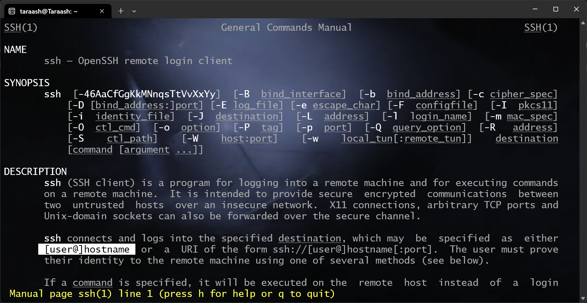
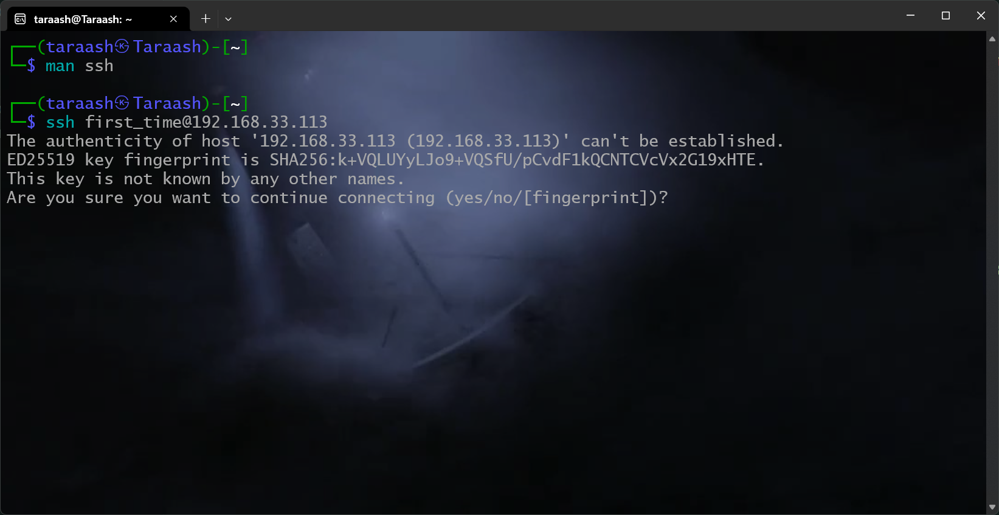
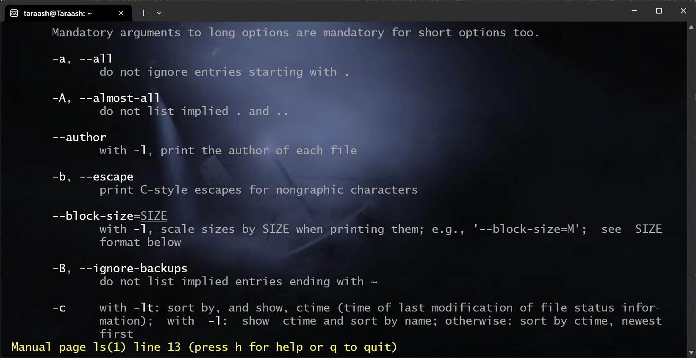
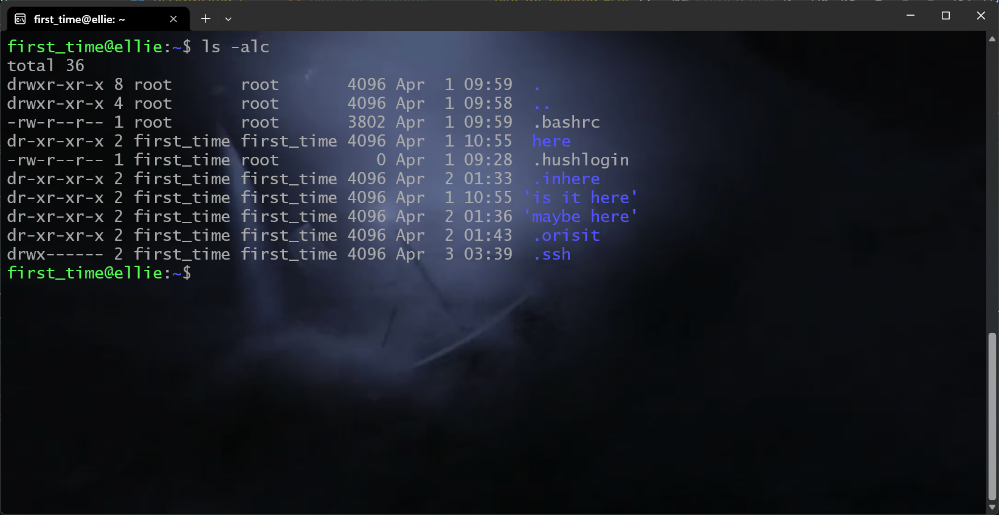
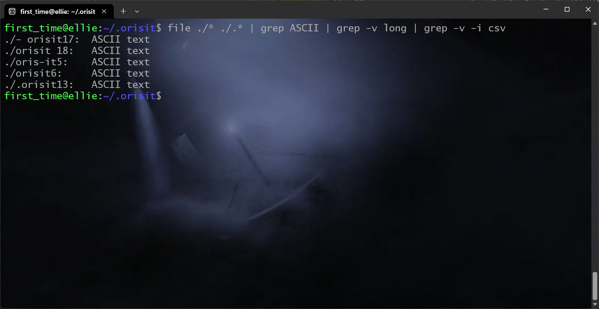
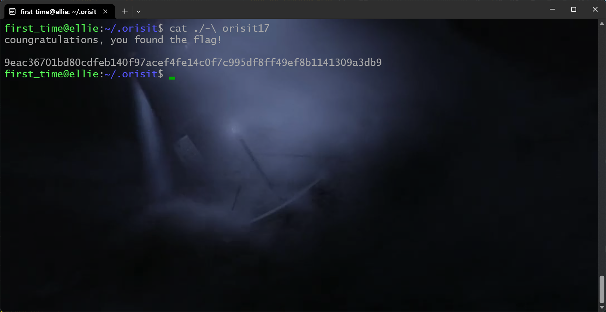

# Let's begin

The most important command you should be aware of is `man`, it stands for manual page and it opens up the documentation of any command that supports it (which is every single command!). I asked you to `ssh` into the box, so let's take a quick look at the `man page` of `ssh` with

```sh
man ssh
```

Output:


Take a look at the highlighted part, I mentioned you should `ssh` into `192.168.33.113` (which is our *host*) as user `first_time`, so that makes our final command to be

```sh
ssh first_time@192.168.33.113
```

Executing this for the first time, you will get something like this:


You get this because `ssh` cannot verify if I'm a good guy or not, say *yes* to that. After that you'll be asked to put in the password `GH{}()[]`, then you'll be greeted and we'll wait for me to automatically redirect you to a virtual machine I've set up (I don't want you snooping around on my laptop!). You don't have to worry about this step, but just in case you were curious, this is why you will see two IP addresses when you exit.

## Now the challenge actually starts

You may notice you are greeted with a very... limiting looking terminal, you get absolutely no information about where you are, who you are and whatever else the terminal you used to get here showed you. This is the classic `sh` shell that decades old Unix shipped with, you might wish to try out the *B*ourne *A*gain *SH*ell (let's see if you can find the command to do so).

Take a look now at the commands I've mentioned you might need, take a look at the `man` pages of them, try out running the command with `--help` or `-h` for some shorter info. Fun fact, you can type `man man` to see what the `man` command does!

That's it for this one, I'll keep adding stuff here till you finally get to the flag. (1256, 3 Apr)

## Walkthrough

I mentioned the flag is in the least updated directory, let's take a look at the manual page of `ls` with `man ls`.

Output:


Take a look at the `-a` and `-c` flags, that's what we need. We can also use the `-l` flag, that'll help us too.

Output


You'll see my terminal *probably* looks better than yours, that's because I'm using `bash` which provided a bunch of helpful features. But mainly, look at the output (ignore the `.ssh`, `.bashrc`, `.hushlogin`, `.`, and `..`). The `.orisit` directory is what we need. Let us now change into that directory with `cd`. The command to do so is

```sh
cd .orisit
```

Now we have a bunch of files, the flag is in the human readable file, taking a look at the man page of `file`, we see it tells us exactly what we need.


Now you could go ahead and run `file` for every single file, but a better way is to use the glob, `*`, which encompasses everything all at once. But running `file *` would give you a ton of errors, that's because some files start with a hyphen (`-`) and most linux utilities think that means a different `switch` should follow, take a look at the `ls` command we ran, we *turned on* switches `a`, `l` and `c`.
We fix this issue by prepending the glob with `./`, this expands to

```sh
file ./orisit0 ./orisit1 ./orisit16 ./- orisit17 ./orisit 18 ...
```

and not something like

```sh
file - orisit17
```

Take a look at the following screenshot



You'll see the command I ran is significantly more complicated, I want you try and see what `grep` does (take a look at the manual!) and what the pipe operator (`|`) does. Play around with what happens when you don't do this.

Take a look at the arguments I gave to `file`, all hidden files or directories in linux are denoted by a `.` in the start of their name, so if we wish to include them, we must use `.*` to capture them.

All human readable files are ASCII, that's why I filtered them down so. Now, finally, our flag is in the file which starts with `-`. The only such file is `- orisit17`.

To read the contents, we use the `cat` command (or anything else like `more` or `less`).

*(you'll see I used the a `\` to escape the space in the name, you could either use quotes to enclose the name)*

We now have the flag. (1321, April 4)

## Other methods

* `cat -- '- orisit17` also works, the `--` part tells a Unix that it shall no longer interpret anything as switches after this. ([Priyanshu Kumar](mailto:priyanshu24067@iiitd.ac.in))

* `find /* -name "-*" 2>/dev/null` finds every file starting with a hyphen from the root (`/`) of the filesystem, and errors are redirected to nothingness (`/dev/null` is always nothing, `2>` redirects `stderr` *(the errors)* to `/dev/null` instead of the terminal, with is `/dev/stdout`). Play around with this, it's interesting. (adding `-type f` would've made it search only files.) ([Arpit Rajput](mailto:arpit23133@iiitd.ac.in))

* `grep -r 'flag' ~ 2> /dev/null` is another interesting one, `-r`, or `--recursive` searches for the string you provided in each file starting from whatever you mentioned, here, `~`, which expands to `/home/first_time`, your home. This works because the file actually has the word *flag* in it, so, be careful. (adding the `-i` flag would've made it a little more foolproof.) ([Mohd Irfan Raza](mailto:irfan22298@iiitd.ac.in))
