# Let's start

I said you'll have to scan for a server named `desmond` on a network with the same subnet mask, that was `255.255.255.0`, which could be abbreviated as `/24`, take a look at the following table

| Network Bits | Subnet Mask | Number of hosts |
| --- | --- | --- |
| /24 | 255.225.225.0 | 254 |
| /23 | 255.255.254.0 | 510 |
| /16 | 255.255.0.0 | 65534 |
| /8 | 255.0.0.0 | 16777214 |

For a complete list, take a look [here](https://www.cloudaccess.net/cloud-control-panel-ccp/157-dns-management/322-subnet-masks-reference-table.html).
[NetworkChuck](https://youtube.com/@networkchuck?si=w-Nr39dWBydAlSCi) has a good video explaining what this means.

Let's first take a look at the IP address of the server we're currently in by running

```sh
ip a
```

This will give us an IP, that, along with our subnet mask knowledge tells us that `desmond` must have an IP whose first three *quartets* are the same (that's what 255 denotes), while the last one can be anything (that's what 0 signifies).

We now wish to find `desmond`'s IP address, we can run that by running a *no-ports* scan via `nmap`.

Output of `man nmap`:


Let's see if you figure out what the command should be now (you could either try the glob character `*`, or use `/24` with the IP).

When you find it, run `nmap` with only it's IP and find the services running on there.

**Everything is misconfigured.**

## Another one


When you&#39;re knee deep, you&#39;ll be asked for something related to *FRACTRAN*, we held an event regarding this a while back, and I released a write-up. We always send everything on telegram, or on mail.

## Walkthrough

If you read the hints for Ellie, I mentioned that you're actually `ssh`'ing into my personal laptop, after which you're automatically redirected to a virtual machine. Hence the IP you put in may not be the IP of the machine you land it, to get the correct IP, we run

```sh
ip addr
```

Output:


Nice! So our IP is `192.168.124.168`. We know want to discover another host living on the same network and the same subnet mask, that is `255.255.255.0`, this means that the first three *quartets* must be the same, so our IP for `desmond` must look like `192.168.124.*`. We'll use `nmap` for this task, specifically the no-ports option as that'll speed things up.

```sh
nmap -sP 192.168.124.*
```

Output:
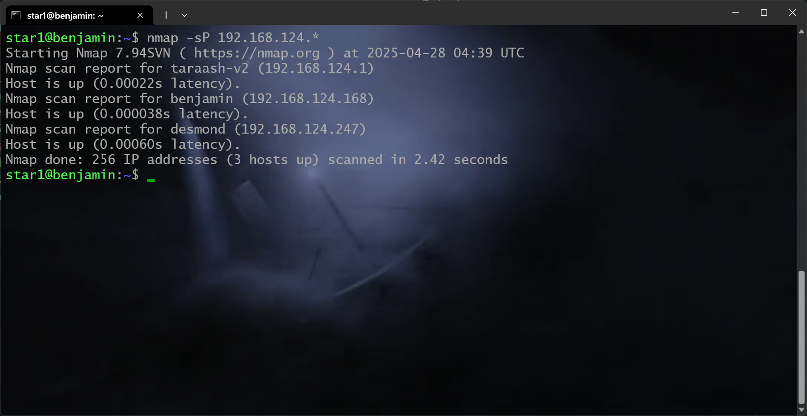
Note that I used the `sP`, and not `sn`, like I previously mentioned (look at the documentation!).

An alternate command that also works is

```sh
nmap -sP 192.168.124.0/24
```

(take a look at the table above, this method is preferred)

We have now found desmond at `192.168.124.247`, let's run `nmap` again, but this time searching for ports. We'll do

```sh
nmap 192.168.124.247
```


We find an `ftp` server, which stands for the file transfer protocol. Fascinating, let's see if we can access it.

```sh
ftp 192.168.124.247
```

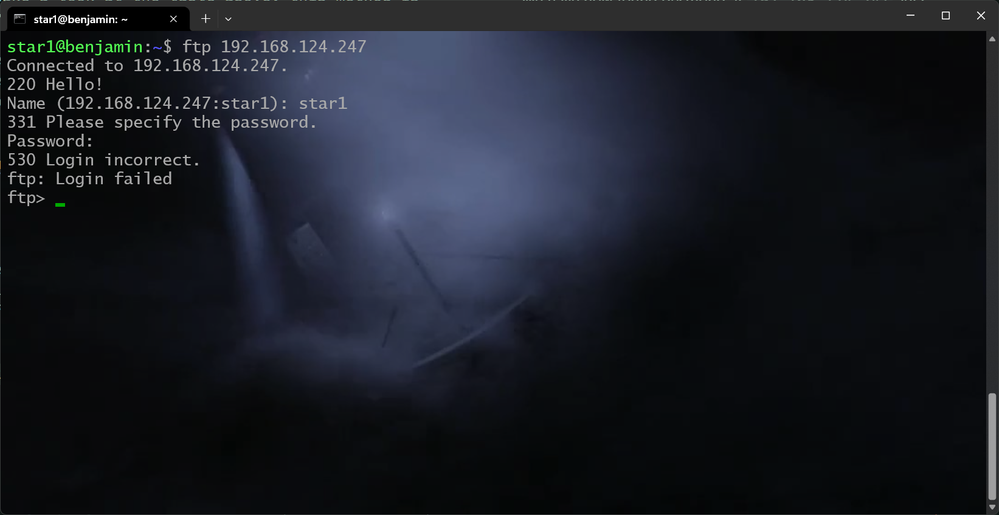

I put my login credentials, we got nowhere. Let's take a look at the man page.


What's this? Let's try it

```sh
ftp -a 192.168.124.247
```


We're in!

Let's now explore, typing `ls`, we see a `flag` and `hint` file. Take a look at what you get when you type `help` in the terminal, which command could you use to view this file?

You might try `get` but that'll give you permission errors. Let's try `less`

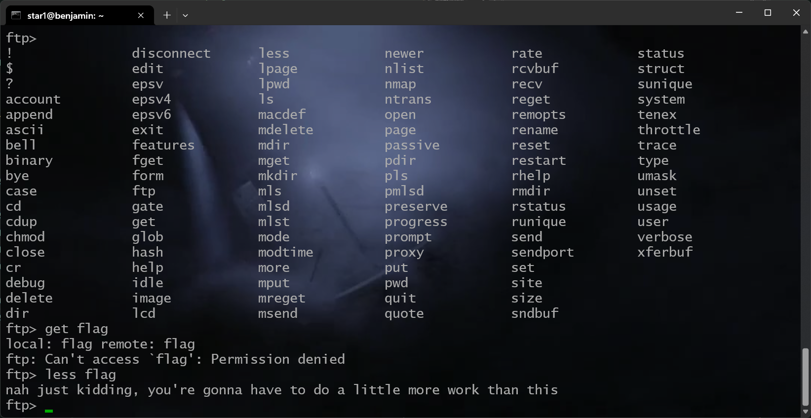

Ope! Not that easy! Let's exit this, and try again with `nmap`.


```sh
nmap -p- 192.168.124.247
```

`-p-` tells `nmap` to scan every port.


Whoa, there's a lot more stuff going on here!

Let's use a few powerful features `nmap` provides to dig deeper. This time I'll limit the ports to only the ones shown by including `-p696,3002,6379` (we're done with the `ftp` service).

One more look at the man page:
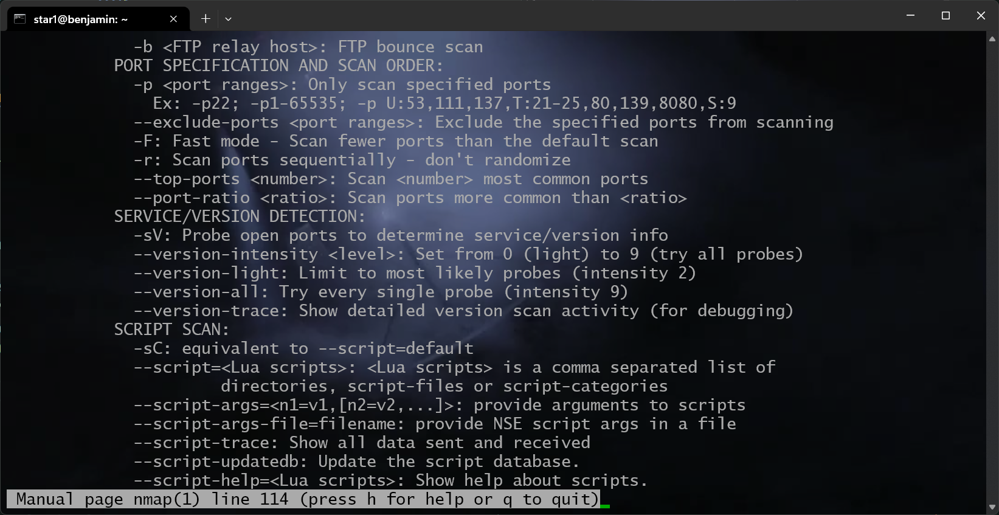

Let's run

```sh
nmap -sV -sC -p696,3002,6379 192.168.124.247
```

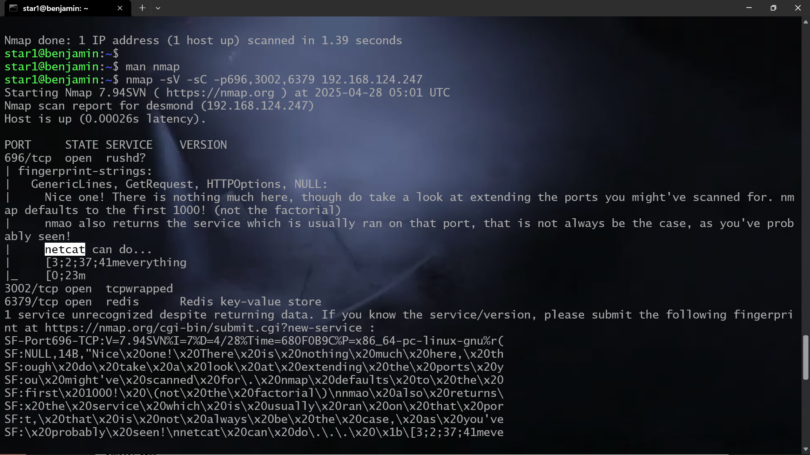

Fascinating, what's `netcat`? If we take a look at the commands I said you might need, theres something called `nc`, let's take a look


This looks promising! Let's run

```sh
nc 192.168.124.247 696
```

as that's the service that told us about `nc`.

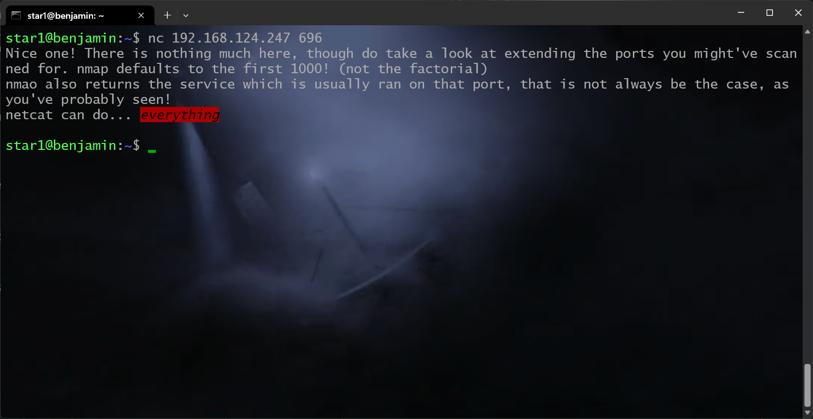

Fair enough, not much information, let's try it on port 3002.

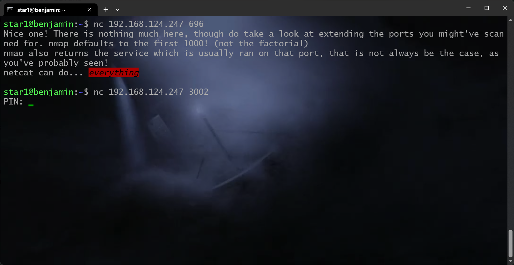

We found something! No idea about the PIN though, but there's another service called `redis` going on. Let's try typing `redis` in our terminal. That didn't get us anything, let's search for redis on the web.


Found this on their GitHub repository, let's run `redis-cli`. We get something, let's take a look at the help section.

(as a side note, running `apropos redis` would have also revealed what we needed, `apropos` is the search utility in linux, take a look at the man page!)

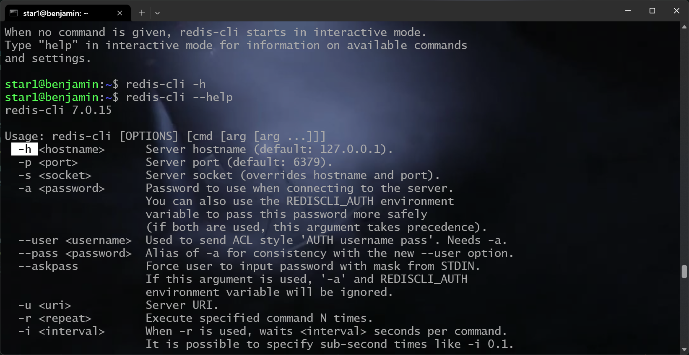

Ok, so now let's run

```sh
redis-cli -h 192.168.124.247
```

We get... Something. This time, the man page isn't helpful. But, take a look at the help out above, we see something like `AUTH username pass`, let's run that. If I put in `star1` I get an error. Remember, I said everything is misconfigured. Let's try some common passwords, like

- admin
- administrator
- root
- anon
- anonymous

Trying and checking, we'll see that `auth root` gets us in and we get an `OK` message.

If you took a look at HTB, we're doing the same thing as one of their boxes, go check them out!

We now note that `redis` is a key-value NoSQL database, so there must be keys I could find. If I type `keys` in the terminal, I am hinted at providing a *pattern*, lets run `keys *` to find everything. We can now `get` the *value* associated to the specific *key*, the *min* and *max* look interesting, so let's get them.

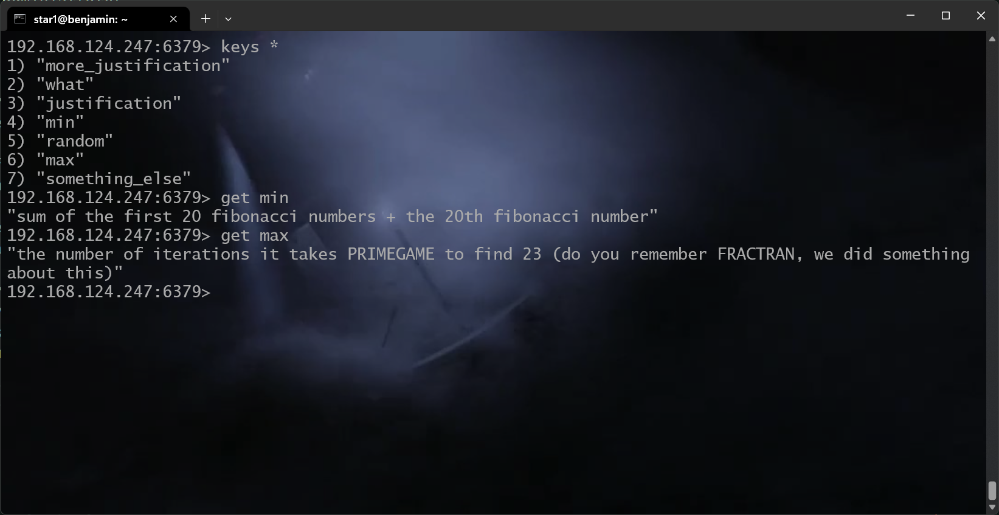

Huh, if we get the *what* key aswell, we see the PIN is constrained, and we just found the *min* and *max* of... something, our PIN probably lies between these!

Let's find the *min* first, creating a simple python script, something like the following

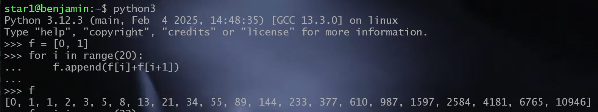

And then summing them up, we find that the minimum is **17710**.

The maximum is an interesting one, our keyword is FRACTRAN, and we did an event for this, for which I released a writeup, let's search for it.


on gmail

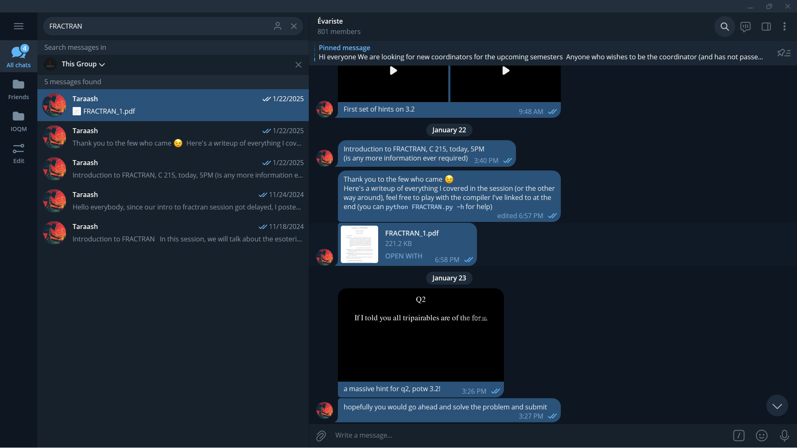
on telegram

Nice, let's open up this PDF


A compiler, that's what we need! Let's download and run this (take a look at the code if you like).

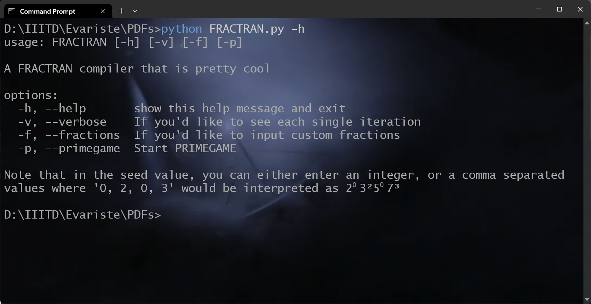
Running `-h`. We need PRIMEGAME, let's run it with `-p`!

This is what we get:


Hence we get a maximum value of **19268**.

We're almost done, I swear!

Last time referencing the hints for Ellie, I used the pipe operator `|`, say we run `A | B`, it takes the (standard) output of `A` and gives it to `B` as the standard input, effectively meaning that you don't have to manually give it to `B`.

Back to port 3002, we need to manually give it a PIN, but we can use the `echo` command to automate it, take a look:


Now all we need is a simple for loop going from the min to the max, and we `echo` that variable, and see if we get something. Take a look at this bash cheat sheet


(found at [this link](https://devhints.io/bash#loops))

Let's do it!

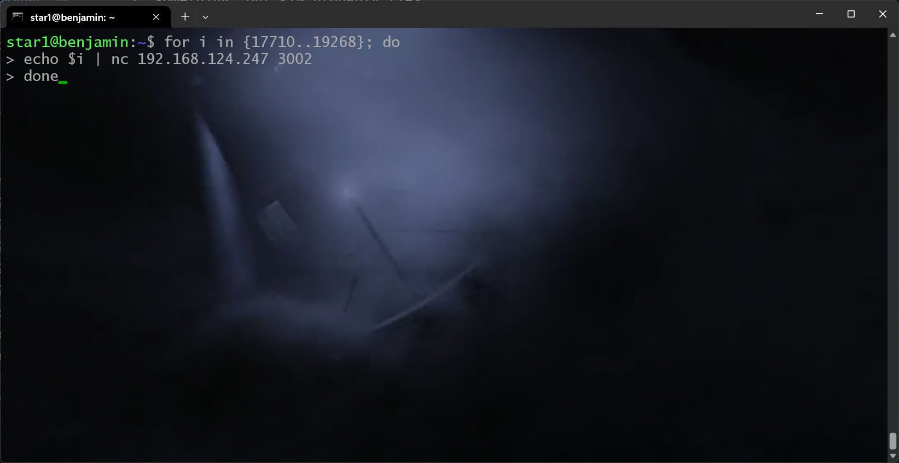

And now we're spamming `desmond` and getting a ton of output, for the tiniest instant you'll see a longer output, press Control-C to stop and scroll up, you'll find

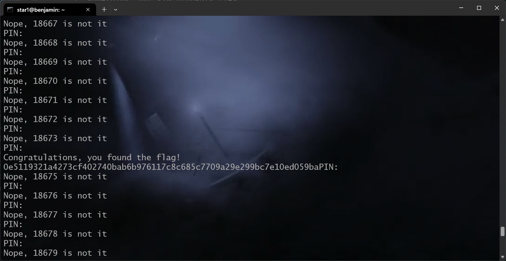

There are, of course, better ways to do it, for example, consider

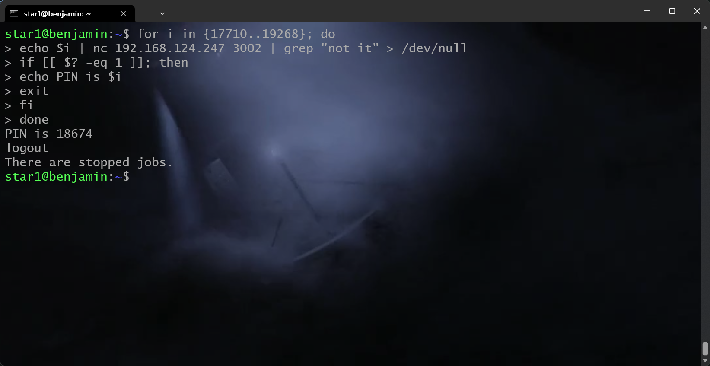

This straight away gives us the PIN, but there's a lot going on here. Let's break it down.


This might help.

1. `grep` returns an *exit code* of 0 (or success) when it's able to find something matching the search criteria.
1. It returns something non-zero when it can't,
1. The variable `?`, accessed via `$?` stores the exit code of the last run command.
1. Redirecting the output (with the `>` redirect) to `/dev/null`, which is a file that has nothing, a black hole, if you will. We do this so we don't see the output of the command we're running - we're only interested in the exit code.
1. `-eq` is the equality operator (for numbers).

I guess that's explanation enough, if you still need help with something, please send me a mail, and I'll update this file.

We're done! We're done! This was a lot, took me an hour to make this walkthrough! Hope you had fun playing.

## A few points

- If you don't like this inline stuff, you could've gone into the `/tmp` directory and wrote the script, with `vi` there.
- If you followed the exact same steps above (or in the ballpark), but didn't get the flag, it's very likely someone else was also on the machine running `nmap`, which, unfortunately, breaks the script accepting the PIN, and it takes me (another script) about 40 *cycles* to bring it back up, so if that's you, please send me a mail.
